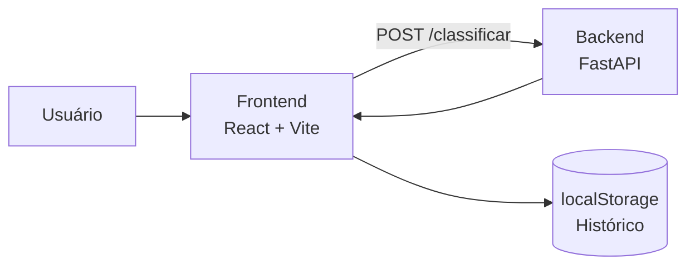
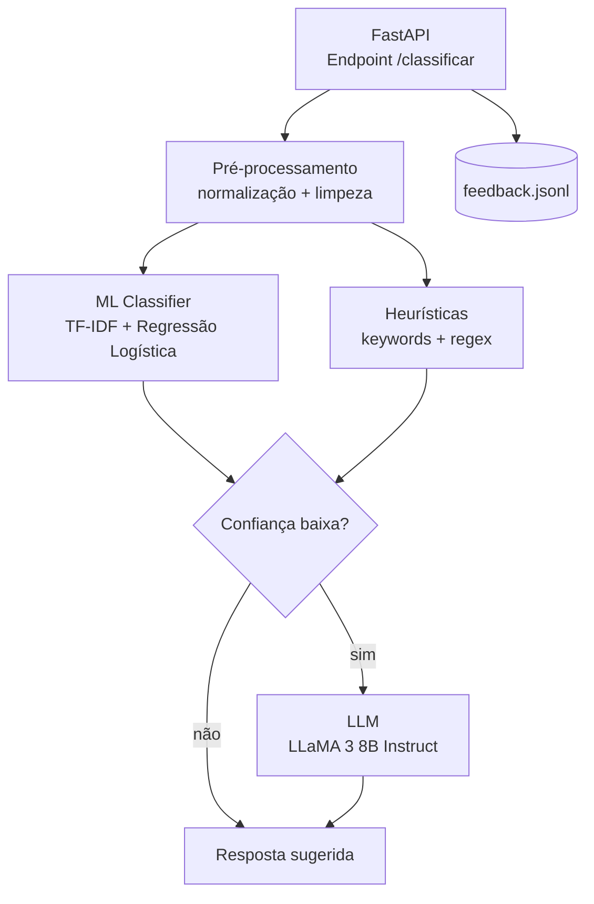

# 📧 FinanceMail — Classificação Inteligente de E-mails Financeiros

O **FinanceMail** é um MVP de **classificação automática de e-mails**, desenvolvido para reduzir ruído operacional e acelerar fluxos financeiros.  
O sistema identifica se uma mensagem é **produtiva** (demanda financeira real) ou **improdutiva** (mensagens sociais ou de alinhamento), calcula um **nível de confiança** e sugere uma **resposta adequada**.

O projeto foi desenvolvido como **produto funcional**, com frontend e backend em produção, arquitetura clara e decisões técnicas orientadas a desempenho, previsibilidade e evolução.

---

## 🎯 Contexto e Motivação

Em ambientes administrativos e financeiros, uma parcela significativa do tempo é consumida na leitura e triagem de e-mails que não exigem ação imediata.  
Essa dor foi observada em um contexto real, onde o setor financeiro precisava constantemente separar mensagens relevantes de comunicações informais.

O FinanceMail surge para:

- Reduzir o tempo gasto com triagem manual  
- Priorizar e-mails que exigem ação financeira  
- Padronizar respostas iniciais  
- Criar base para automação e métricas futuras  

---

## 🧠 Visão Geral da Solução

Dado o conteúdo de um e-mail, o sistema retorna:

- **Categoria**: produtivo ou improdutivo  
- **Nível de confiança** da classificação  
- **Resposta sugerida**, adequada ao contexto  
- **Feedback do usuário**, permitindo correção  

As últimas classificações ficam salvas localmente no navegador, facilitando acompanhamento e validação.

---

## 🏗️ Arquitetura Geral



---

## ⚙️ Arquitetura Detalhada (Backend)



---

## 🧪 Estratégia de Classificação

A decisão final é construída a partir de três camadas:

### 1. Modelo Supervisionado
- TF-IDF + Regressão Logística  
- Execução rápida, determinística e interpretável  

### 2. Camada Heurística
- Normalização de texto  
- Palavras-chave financeiras  
- Expressões regulares para valores, datas e documentos  

### 3. IA Generativa
- Ativada em casos de baixa confiança  
- Responsável pela geração da resposta sugerida  

---

## 💬 Feedback e Aprendizado

O usuário pode corrigir a classificação quando necessário.  
O feedback é persistido em `feedback.jsonl`, permitindo análise e retreinamento futuro.

---

## 🧰 Stack Tecnológica

**Frontend:** React, Vite, JavaScript  
**Backend:** Python, FastAPI, Pydantic, Scikit-learn  
**IA:** TF-IDF, Regressão Logística, LLaMA 3 8B Instruct  
**Infra:** Render (Static Site + Web Service)

---

## 🚀 Execução Local

```bash
cd backend
pip install -r requirements.txt
uvicorn main:app --reload
```

```bash
cd frontend
npm install
npm run dev
```

---

## 🛣️ Roadmap

- Retreinamento automático com feedback  
- Upload de PDFs (boletos e notas fiscais)  
- Dashboard de métricas  
- Integração com e-mail real  

---

## 👩‍💻 Autora

**Vitória Oliveira Rotta**  
Engenharia da Computação  
